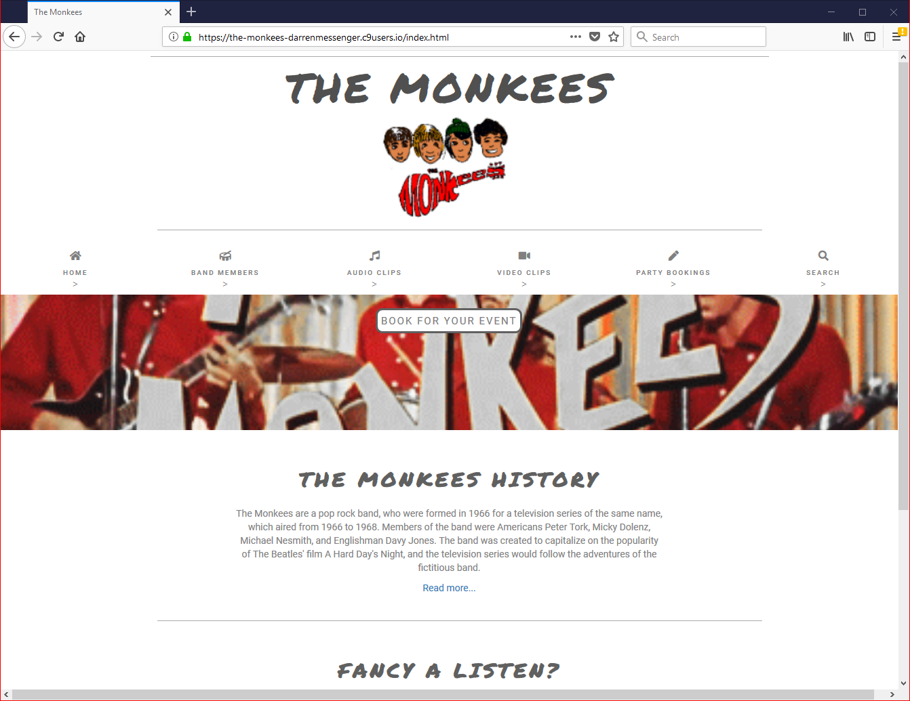

# The Monkees

## Reason For Project

This project has been built for the User Centric Frontend Development Milestone Project. The brief was to build a static (front-end only) website for a band. 
The band is a 1960’s rock band (The Monkees!) and have around 50 years experience of performing live at numerous events around the world. 
Their primary target audiences are their fans and potential fans who wish to use the site to see and hear clips from their back catalog, and any new material as it becomes available.
Also, the band would like to use the site to showcase their music and publicise their availability to perform at events such as weddings and Christmas parties.

The website should include:
Photos of the band members
A video clip
Audio clips

Also, they are in the process of creating a social media presence and would like to add links to their Facebook, Twitter and YouTube pages.

#### Header:
There is a header on each page which includes an image. If the image is clicked it will take the user back to the landing page. 

#### Navigation:
On the top of each page there is a navigation bar so that each page can be clicked. The navigation bar remains constant on each page and uses hover.css when hovering over each menu item so that the menu item is highlighted. 

#### Footer:
At the bottom of each page there are links to various social media including Facebook, Twitter and YouTube. The links also uses hover.css so they are highlighted when hovered over. These links do not do anything yet. 

#### The Landing Page:
A full width background gif with a button to link you to the booking page so that you can book the Monkees for your next event. There is also a short history of the Monkees with a link via Wikipedia to learn more about them. 
If you can't remember how the Monkees sound there is a sample track to remind you. 

#### The Band Members:
Each member has a description from Wikipedia along with a photo. There is also a 'Read more...' with a link to Wikipedia for each member. The page utilises the bootstrap grid layout. 

#### Audio Tracks:
There a some sample audio tracks from the Monkees on this page. The page utilises the bootstrap grid layout. 

#### Video:
There is a page with a video showing one of the Monkees tracks. 

#### Party Bookings:
A form to allow the user to enter details so that they may book the Monkees to appear at their own event. All the details are very clear using descriptive placeholders. 

#### Search:
This is displayed on the navigation bar but it doesn't do anything yet. 

#### Built With
Bootstrap, html and css have been used during the coding of this website. 

#### Author
Darren Messenger